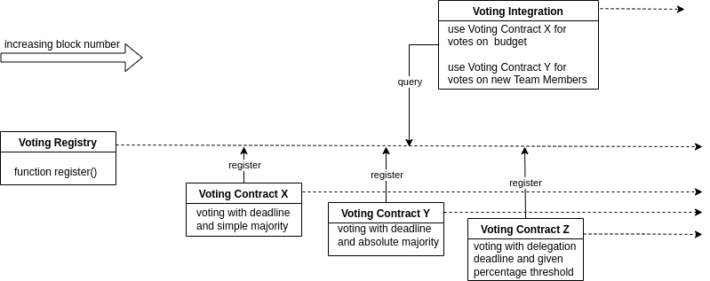

# Voting Registry Contracts

## Summary

This package contains the solidity contract for a proposed voting registry as well as interfaces and inheritable abstract contracts that meet the proposed standardized requirements for a basic on-chain voting contract. 

## Motivation

It would be great to have a simple registry where all possible voting interfaces and varieties can be registered and queried. This would solve the problem of needing to deploy the n-th version of a simple majority voting dapp, or token-wheighted voting dapp or first-pass-the-post dapp or delegated voting dapp or aggregated voting dapp or what not. Every type of customized voting functionality could be implemented, too. The user contract simply implements a simple interface and can just choose which voting dapp it uses for its votes. It would hook up to the registry and receive the voting app that meets the needs. The voting app needs to have three functions implemented, namely `start`, `vote` and `implement`. The first one, i.e. `start`, receives the `votingParameters` in *byte*-form and, depending on the requirements, also the implementation parameters (`selector` in *bytes4* and `functionParameters` in *bytes*). The second one, i.e. `vote`, handles the logic of the voting that depends on the votingParameters passed in the `start`-function. The last one, namely `implement`, handles the action taken when the conditions for the vote are met. Optionally each voting app may also implement all sorts of other functions and auxilliary functions.

## Ingredients

The whole setup consists of 

    1. A voting registry (`./registry`)
    2. Voting Contracts (`./voteContract`)
    3. Voting Integrations (`./integration`)

## Scheme

The following figure summarizes the basic working mechanism of the voting registry.


## Developers

Developers may consult the extensive documentation inside the solidity files. Compilation of the contracts is done via the [`solc` package](https://www.npmjs.com/package/solc-js). The following command bundles the compilation up and copies the output into the `compiler-output` folder, which is created if it doesn't exist:
```
npm run compile
``` 
